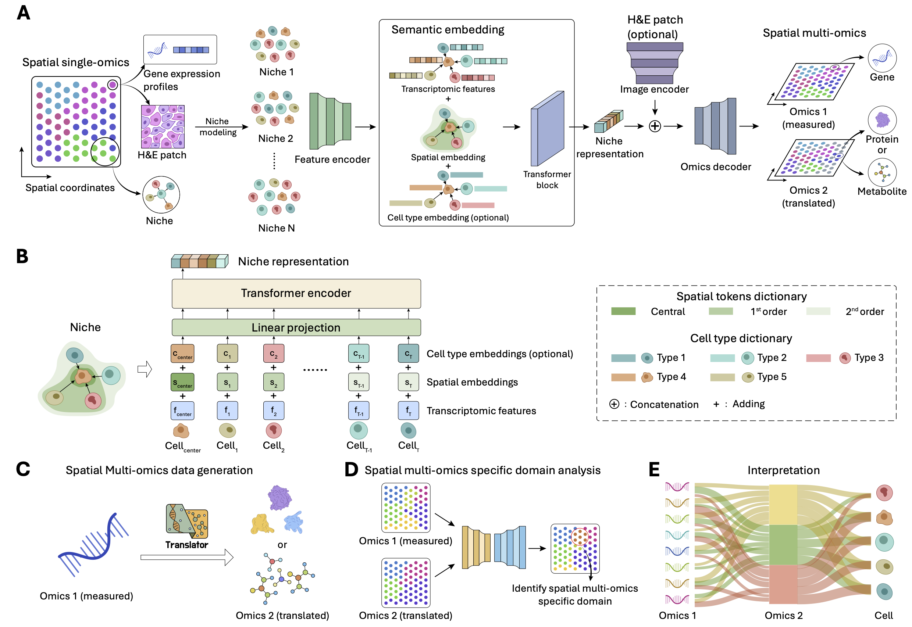

# NicheTrans: Spatial-aware Cross-omics Translation  (Not finished yet)
This is the *official* Pytorch implementation of "NicheTrans: Spatial-aware Cross-omics Translation". 

## Pipeline


## Requirements
### Installation
```bash
pip install -r requirements.txt
(Here, we list some important packages crucial for model reproduction.）
```

### Prepare Datasets
Spatial Multimodal Analysis (SMA) dataset of Parkinson's Disease from ['Spatial multimodal analysis of transcriptomes and metabolomes in tissues'](https://www.nature.com/articles/s41587-023-01937-y). 

STARmap PLUS dataset of Alizimizer's Disease from ['Integrative in situ mapping of single-cell transcriptional states and tissue histopathology in a mouse model of Alzheimer’s disease'](https://www.nature.com/articles/s41593-022-01251-x).

Human breast cancer dataset from ['High resolution mapping of the tumor microenvironment using integrated single-cell, spatial and in situ analysis'](https://www.nature.com/articles/s41467-023-43458-x). 

Human lymph node dataset from ['Deciphering spatial domains from spatial multi-omics with SpatialGlue'](https://www.nature.com/articles/s41592-024-02316-4).

MISAR-seq dataset from ['Simultaneous profiling of spatial gene expression and chromatin accessibility during mouse brain development'](https://www.nature.com/articles/s41592-023-01884-1).

The details for processing SMA and STARmap PLUS datasets are placed in the folder '1_Data_preparation'.
Here, we released the processed spatial multi-omics data at ['GoogleDrive'](https://drive.google.com/drive/folders/1YKBM-N4bP6WJyQ07EmRoZI5lQl0EKFF6?usp=drive_link). Please feel free to reach out to us if the link has expired. 

## Model training
For each spatial multi-omics data, we wrote a specific *.py* file for model training and testing. 
Here, taking the human lymph node dataset as an example:
```bash
python Human_lymph_node_train_rna.py 
```
Users need to change the path while loading different datasets. 

## Model testing
We provide the jupyter notebook for quantitative evaluation using pcc, spcc, and qualitative visualization of the translated results. 
```bash
visualize_lymph_node.ipynb
```

## Acknowledgement
[Stagate](https://stagate.readthedocs.io/en/latest/index.html#), [SpatialGlue](https://spatialglue-tutorials.readthedocs.io/en/latest/index.html), [GraphST](https://deepst-tutorials.readthedocs.io/en/latest/#), [SEDR](https://sedr.readthedocs.io/en/latest/index.html).

## Contact
If you have any questions, please don't hesitate to contact us. E-mail: [zhiyuan@fudan.edu.cn]@(mailto:zhiyuan@fudan.edu.cn); [zhikang.wang@monash.edu](mailto:zhikang.wang@monash.edu).
